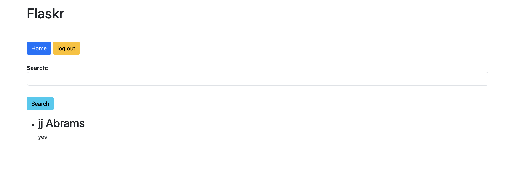
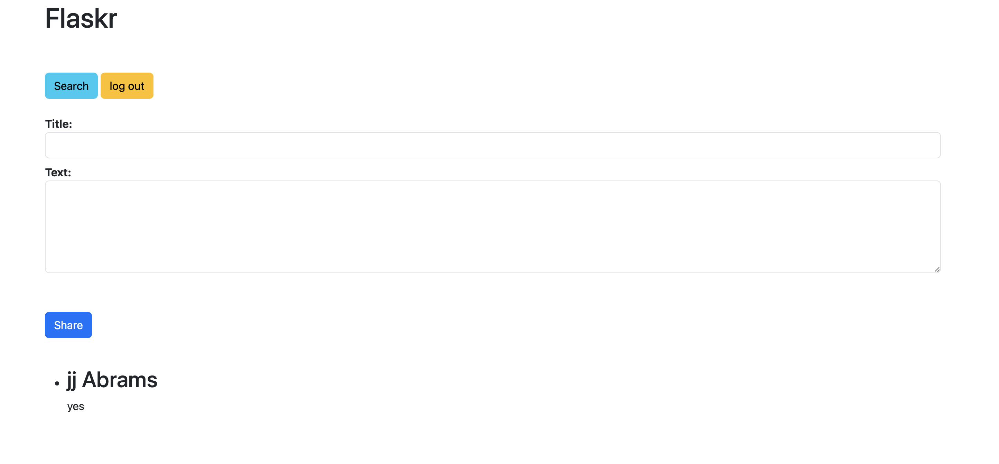
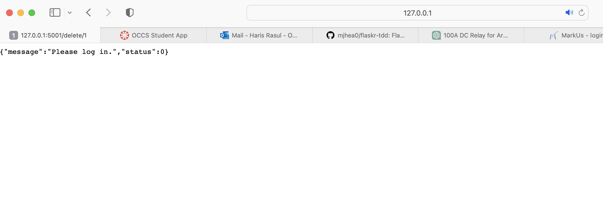
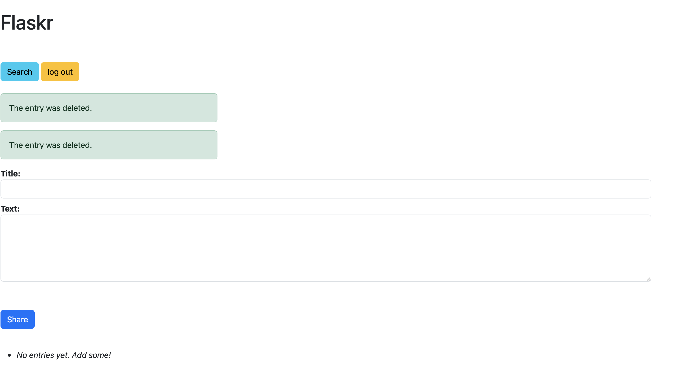

# Lab 5

By: Haris Rasul

Date: Oct 29 2023

This is a clone copy of https://github.com/mjhea0/flaskr-tdd

# Please VIEW BOTTOM FOR BENEFITS AND CONS OF TDD

# Activity 1: Images

# Activity 2: Project TDD Integration

Please view the folloiwng link for the unit test I have added to our own app project Group 30:
https://github.com/ECE444-2023Fall/project-1-web-application-design-group30-bytes/blob/dcce9dec7187af6250a788a831525d4d267b21b5/testingFolders/app_test.py#L14-L29

# Activity 3: Benefits and Issues of TDD

Some of the benefits of TDD is naturally better code quality by having tests that ensure your reuslts are returned correctly and accuartely, while also being able to examine as many edge cases as possible. It also allows for early bug detection as traditional esting would be done after dveelopment, which can be a cascading problem is not solved early on and can affect many depedancies - so TDD is beneficial in preventing those types of situations early on. Testing processes in TDD are not rushed either near the end during deploymnet of production that would happen more frequently with traditional testing. TDD also allows you to automate testing by creating tests with expected beahviour before full development of a compoenent, we can wriet tests and then refactor code to ensure that it passes exoected user behaviour. TDD also enables better teamwork by being able to show members how certain components are expected to behave as the tests would dcoumnet that behvaiour. Code refactors are easier to implement as well as any drastic chnages to file structure or code componenets can be caught by the test cases in TDD should they change as a result. It helps you break down probelms into smaller pprts with Verification Specification as if and when a test fails, it indicates a discrepancy between the system's behavior and the initial requirements. It is a great framework taht allows you to guide your logic through simpler tests, and then further allow for more flexible code refactoring. Some cons of this framework is that it takes more time to develop tests before development and can increase dveelopment time especially if you use it to guide your logic and expansion of code. Another issue to be weary of is that the tests in TDD can be too simple and is dependant on the developer to think of multiple edge cases, meaning that TDD is not going to ncessairly help figure out all possible user egde cases that need to be solved/debugged unless the developer has thought of it. There also may be a lot more mainatance to ensure test files are corrcet and up to date as a developer constantly updates their development code base, new tests have to be added, also older logic that was removed/ chamnges should also be refekcted in the test files, if certain tests are no longer relevant. Other porblems include tests that are too big less with a less modular approach, writing redundant tests, writing tests for trivial code, as well inconsistnet usage over time. This coupled with time and maintance overhead are issues with the framework that should be considered. 
 
